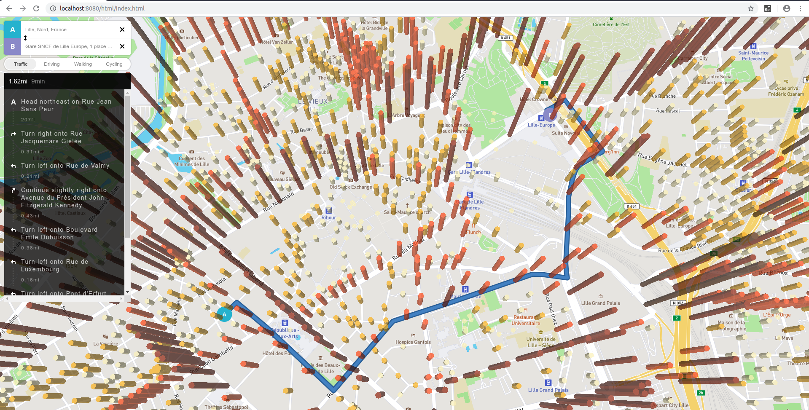
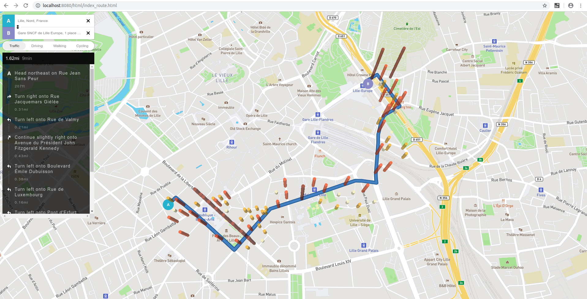

# *IIR - M2-Eservice - Université de Lille - 2019-2020*

---

**Sarah BEN ABDESSLEM, Caméléa OUARKOUB, Jayjaywantee KOODUN, Thi-Ngoc-Anh TRAN, Clara VERQUERRE**

### Projet déployé :

- https://iir.herokuapp.com/html/index_route.html
- https://iir.herokuapp.com/html/index.html

### Projet utilise Mapbox.js, 
Read more : 
- https://www.mapbox.com/
- https://docs.mapbox.com/mapbox-gl-js/example/animate-a-line/

### Données :
- https://opendata.lillemetropole.fr/explore/dataset/voies_mel/table/?flg=fr

### Execution :
- Transformation des données : 
    - données originales : voies_mel.geojson
    - check les données de trafic différents `test_trafic.py`
    - transformer le fichier par `create_feature_circle.py`
    - données transformées : voies_mel_draw_circle.geojson
- Lancer un server à la racine du projet (là où il y a README.md) : `php -S localhost:8080`
- sur un navigateur : 
    + Example 1 : `http://localhost:8080/html/index.html`
    + Example 2 : `http://localhost:8080/html/index_route.html`

### Exemples :
- Exemple avec tous les histogrammes

- Exemple avec les histogrammes qui sont sur cette route cherchée

