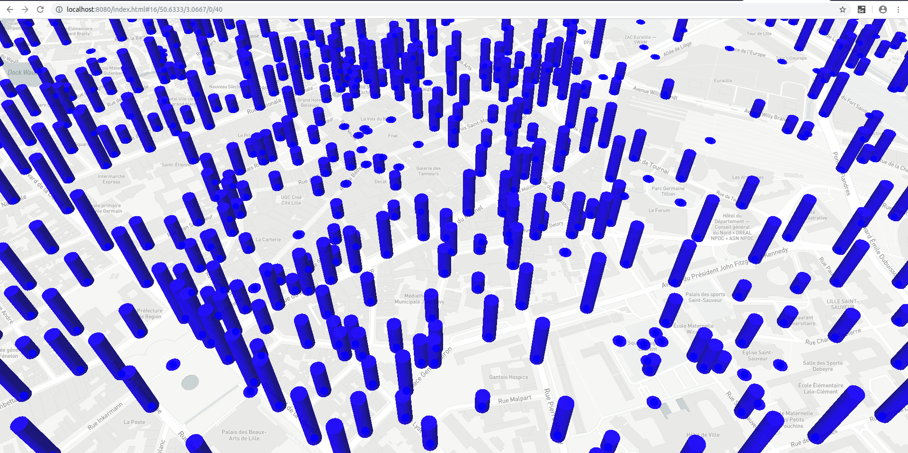

# *IIR - M2-Eservice - Université de Lille - 2019-2020*

---

**Sarah BEN ABDESSLEM, Caméléa OUARKOUB, Jayjaywantee KOODUN, Thi-Ngoc-Anh TRAN, Clara VERQUERRE**

### Run cette commande ci-desous puis ouvrir par index.html:

> npm install mapbox-gl --save

### Read more :
https://docs.mapbox.com/mapbox-gl-js/example/animate-a-line/


### Add your map to the site : 

    ```
    var mapboxgl = require('mapbox-gl/dist/mapbox-gl.js');
    
    mapboxgl.accessToken = 'pk.eyJ1Ijoibmdhbmh0YWthIiwiYSI6ImNrMmxxbTd3OTA1eHEzZW8yY3VvZjVxeGEifQ.8V-7GFmm1KEG2ZGtCgkdbw';
    var map = new mapboxgl.Map({
    container: 'YOUR_CONTAINER_ELEMENT_ID',
    style: 'mapbox://styles/mapbox/streets-v11'
    });
    ```

### Données :
- https://opendata.lillemetropole.fr/explore/dataset/voies_mel/table/?flg=fr

### Execution :
- check les données de trafic différents `test_trafic.py`
- transformer le fichier par `create_feature_fill_extrusion.py`
- Lancer un server à la racine du projet (là où il y a README.md) : `php -S localhost:8080`
- sur un navigateur : `http://localhost:8080/index.html`


